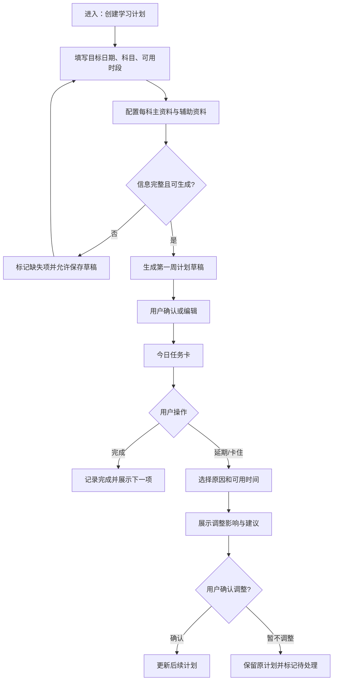
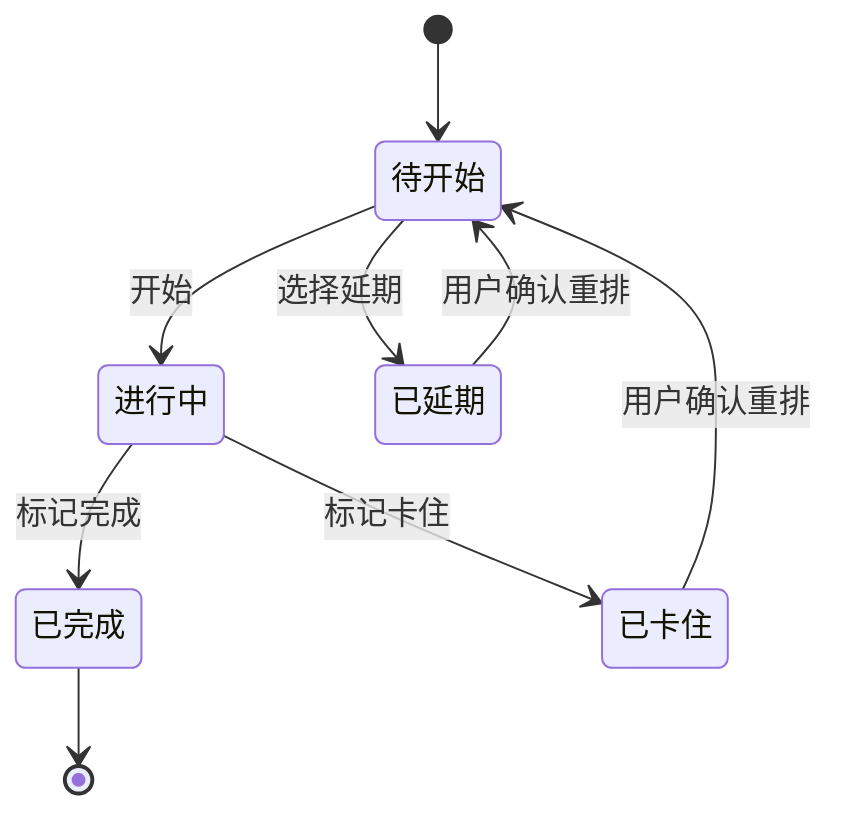

# 学习辅助软件 / 小程序 PRD 评审包

- 版本：0.1（MVP 评审稿）
- 日期：2026-08-10
- 产品名称：学习计划助手
- 评审对象：目标用户、产品范围、核心流程、验收边界、风险与验证计划
- 证据等级：已核实公开资料 / 创始人场景观察 / 待验证假设；三者严格分开。

---

## 0. 评审结论

建议立项为一个**面向目标明确、周期较长考试与自学任务的“动态学习计划执行工具”**，首发优先覆盖考研用户，产品形态采用微信小程序优先、H5 同步可用。

MVP 不做课程售卖、题库社区、直播、通用笔记替代品或全自动 AI 教学。只验证一个闭环：**用户配置目标与资料 → 获得可执行的今日任务 → 完成/延期/说明阻塞 → 系统按规则调整下一步。**

立项前必须完成 12–15 名目标用户访谈与一轮 100+ 份问卷；在此之前，需求优先级均为待验证假设，不把创始人个人体验当成市场事实。

---

## 1. 研究摘要

### 1.1 研究方法与边界

| 项目 | 当前状态 | 结论可用范围 |
|---|---|---|
| 公开产品/开源项目案头研究 | 已完成初步核验 | 可用于竞品能力映射，不可推断真实留存或付费意愿 |
| 创始人场景观察 | 已提供：长期、多科、资料复杂的备考协作 | 可形成产品假设，不等同用户访谈 |
| 用户访谈 | 未开展 | 所有痛点频率、意愿、价格与优先级均待验证 |
| 问卷/行为数据/可用性测试 | 未开展 | 不得宣称目标用户普遍如此 |

### 1.2 目标用户（待验证假设）

| 分层 | 特征 | 待解决任务 | 为什么优先 |
|---|---|---|---|
| P0：考研备考者 | 多科、周期 3–12 个月、资料来源多、每天可用时间波动 | 把长期计划落成今天能完成的任务，并在落后时重新编排 | 目标、日期和完成标准明确，适合验证动态计划闭环 |
| P1：考公/考编备考者 | 科目组合固定、刷题与时政并行、节点密集 | 按阶段安排课程、练习、复盘和模拟 | 需求结构相似，但资料及节奏差异需后置验证 |
| P2：职业证书/长期自学者 | 目标较清晰，但课程/资料更分散 | 规划、执行、复盘 | 具备扩展性，但首版不以其驱动信息架构 |

### 1.3 场景、痛点、需求证据与机会点

| 场景 | 用户想完成的事 | 当前证据 | 痛点判断 | 机会点 |
|---|---|---|---|---|
| 首次建计划 | 输入考试日期、科目、可用时段、已有资料 | 创始人场景观察 | 待验证：用户难以将大目标拆到当天 | 用结构化向导，而非一次性生成长文计划 |
| 每日开学 | 不用重新决定“今天学什么” | 创始人场景观察 | 待验证：选择成本与拖延相关 | 单张今日任务卡，含资料、时长、完成标准 |
| 多资料学习 | 避免同一知识点被多套资料反复覆盖或冲突 | 创始人场景观察 | 待验证：资料冲突是否足以影响留存 | 每科设置主资料/辅助资料/暂不并用清单 |
| 未完成后的恢复 | 落后后继续推进，而非放弃整个计划 | 创始人场景观察 | 待验证：简单顺延会否损害信任 | 记录原因，提供保守重排建议并允许用户确认 |
| 周期复盘 | 知道薄弱项与下周优先级 | 公开工具普遍提供任务/记录能力；本产品差异待验证 | 待验证：用户是否愿意持续记录 | 用最低摩擦的完成、延期、阻塞三态获取数据 |

### 1.4 待验证假设清单

1. 考研用户更愿意持续打开“今天只做什么”的页面，而不是浏览完整计划表。
2. 给任务绑定资料、时长和完成标准，会提升首周完成率。
3. 用户愿意用“完成 / 延期 / 卡住原因”三个操作取代自由文本日报。
4. “资料冲突提醒”是可感知差异，而不是低频功能。
5. 用户接受系统建议重排，但需要保留最终确认权。
6. 小程序的低打开成本比独立 App 更利于日常使用；需通过投放或访谈验证。

### 1.5 建议研究计划（立项门槛）

- **半结构访谈 12–15 人**：考研 8 人、考公/考编 4 人、长期自学 3 人；每人 45 分钟，要求展示最近一次制定计划、漏做任务、换资料的真实过程。
- **问卷 100+ 份**：验证资料数量、每日计划频率、未完成后的处理方式、愿意交出的数据和可接受价格。
- **5–8 人可用性测试**：以可点击原型测试“建计划—完成—延期—调整”是否可独立完成。
- **关键判定**：若 8/12 以上访谈对象认可“自动重排”但要求可撤回，则保持该功能；若资料冲突提及率低，则移出 MVP。

---

## 2. 市场与开源对标

### 2.1 已核实公开对标

| 对象 | 已核实能力 | 优点 | 局限 / 与本产品的空白 | 对产品的启发 |
|---|---|---|---|---|
| Notion | 模板、数据库、任务与知识管理平台 | 自定义能力强，适合搭建个人系统 | 配置成本高；不会天然把考试日期、科目与延期后果变成今日行动 | 不把用户变成计划搭建者；首版只做必要字段 |
| Microsoft To Do | 任务清单、My Day、提醒、步骤等任务管理 | 日任务入口明确，操作摩擦低 | 通用待办，不理解学习任务、资料、复习与考试节点 | 今日页要极简；学习语义必须结构化 |
| Forest | 通过专注时段与成长反馈支持专注 | 反馈直观，专注开始门槛低 | 只解决“坐下来”，不解决“该学什么”和计划恢复 | 专注计时可后置为任务内工具，不是 MVP 核心 |
| Pomofocus | 浏览器端番茄钟与任务列表 | 上手极快，轻量记录 | 不含长期计划、资料约束、动态重排 | 保留低摩擦交互，避免做成复杂系统 |
| small-bears/Postgraduate（GitHub） | 公开描述显示学习资源、学习计划、进度记录、论坛、在线考试等模块 | 功能覆盖广，可作后台信息架构参考 | 项目说明未呈现“基于未完成原因的动态计划恢复”能力；星标/代码可用性不等于产品验证 | 不复制资源/论坛/考试大而全路线，首版围绕执行闭环 |
| small-bears/Postgraduate-（GitHub） | 公开描述含学习计划、资料分类、视频分享、院校信息等 | 显示考研管理类系统已有常见模块 | 功能更偏信息管理与内容聚合，首版不应照搬 | 资料分类仅服务于任务绑定与冲突提示 |

### 2.2 公开来源

1. Notion 产品页：<https://www.notion.com/product>
2. Microsoft To Do：<https://www.microsoft.com/microsoft-365/microsoft-to-do-list-app>
3. Forest：<https://www.forestapp.cc/>
4. Pomofocus：<https://pomofocus.io/>
5. GitHub 仓库：<https://github.com/small-bears/Postgraduate>
6. GitHub 仓库：<https://github.com/small-bears/Postgraduate->
7. GitHub 搜索 API（考研小程序）：<https://api.github.com/search/repositories?q=%E8%80%83%E7%A0%94+%E5%B0%8F%E7%A8%8B%E5%BA%8F&sort=stars&order=desc&per_page=10>

> 核验时间：2026-08-10。上述来源仅支持“公开页面/仓库描述存在相应能力”的判断；未使用应用商店评分、付费数据、下载量或用户评论来推断市场结论。

### 2.3 差异化命题（待验证）

不是“又一个 AI 学习助手”，而是：**把考试目标、资料约束和每日执行状态连成可恢复的计划系统。**

差异化由三个必须同时成立的能力构成：
1. 今日任务具有资料、预计时长、完成标准和优先级；
2. 未完成必须带原因，系统据此给出可撤回的调整；
3. 同一科的资料选择受到主/辅/暂停并用规则约束。

---

## 3. 问题定义、目标与非目标

### 3.1 问题定义

目标明确的学习者常有长期目标与大量资料，但每日执行需要反复做选择；计划落后后，通用待办只能延后，无法解释对考试节点、复习任务和资料安排的影响。该问题的普遍性、严重程度和付费意愿尚待用户研究验证。

### 3.2 产品目标（MVP）

1. 让新用户在 10 分钟内完成一个包含目标日期、科目、可用时段和资料的可执行计划草稿。
2. 让用户在今日页 30 秒内知道下一项应该做什么、用什么资料、做多久、做到什么算完成。
3. 让用户对未完成任务能在 1 分钟内选择原因并得到不丢失关键信息的重排建议。
4. 为产品团队积累结构化行为信号，验证核心假设，不以“AI 对话次数”作为北极星指标。

### 3.3 非目标（明确不做）

- 不替代教师、诊断学习障碍或承诺上岸/提分结果。
- 不在 MVP 做题库、直播课程、公开社区、资料交易、组队排行、广告或付费订阅。
- 不自动导入或分发受版权保护的课程、讲义、真题答案。
- 不让 AI 在无用户确认时直接删除、覆盖或大幅压缩既有计划。
- 不把通用笔记、日历和待办全部重做。

---

## 4. 用户旅程与核心流程

### 4.1 用户旅程地图

1. **建立基础**：选择目标类型，填写目标日期、科目、每周可用时间与高效时段。
2. **配置资料**：每科指定主资料、可选辅助资料和暂不并用资料。
3. **确认计划草稿**：系统生成第一周任务，用户可编辑并确认。
4. **执行今日任务**：打开今日页，开始、完成、延期或标记卡住。
5. **恢复与复盘**：系统展示影响和建议调整，用户确认后更新后续计划。

### 4.2 核心流程图



### 4.3 任务状态机



---

## 5. 用户故事与功能需求

### US-01：建立计划（P0）

- **作为**有明确考试/学习目标的用户，**我希望**填写目标日期、科目、可用时间和高效时段，**以便**得到可确认的第一周计划草稿。
- **前置条件**：已登录或以本地草稿模式进入。
- **业务规则**：
  1. 目标日期、至少一个科目为生成计划的必填项。
  2. 用户未填写每周可用时长时，系统不得伪造精确任务量，应提示补充或生成“待调整草稿”。
  3. 系统生成的是可编辑草稿，未确认前不覆盖既有已确认计划。
  4. 首版仅支持单一主目标；多考试目标标为后续范围。
- **异常/降级**：生成失败时保留输入，显示重试与手工添加首个任务入口；离线时允许保存本地草稿并在恢复网络后提示同步。

```text
┌──────────────────────────────┐
│ 创建学习计划                 │
│ 目标类型 [考研 v]            │
│ 考试日期 [2026-12-xx]        │
│ 科目 [+ 添加科目]            │
│ 高效时段 [下午 v]            │
│ [保存草稿]      [生成第一周] │
└──────────────────────────────┘
```

### US-02：配置资料边界（P0）

- **作为**资料较多的用户，**我希望**为每个科目配置主资料、辅助资料与暂停并用资料，**以便**避免同一时间段被冲突材料占用。
- **业务规则**：
  1. 每科最多一个“主资料”；辅助资料可以为空或多个；暂停并用只作提醒，不评价资料质量。
  2. 今日任务默认引用主资料；引用辅助资料必须展示“辅助”标识。
  3. 当用户尝试在同一科同一阶段添加两个主资料时，要求其保留一个主资料或降级为辅助资料。
  4. 系统不宣称资料内容一定冲突；“冲突”仅指用户定义的不可同时并用规则。

```text
┌──────────────────────────────┐
│ 434 国际商务                 │
│ 主资料  [希尔第9版      ]    │
│ 辅助资料 [+ 添加          ]  │
│ 暂不并用 [+ 添加          ]  │
│ 说明：今日任务优先使用主资料 │
│                    [保存]    │
└──────────────────────────────┘
```

### US-03：执行今日任务（P0）

- **作为**正在学习的用户，**我希望**打开后看到唯一明确的下一步任务，**以便**立即开始而不是重新规划。
- **业务规则**：
  1. 今日页首屏只突出一项“现在做”的任务；其余任务折叠在今日清单内。
  2. 任务必须显示：科目、资料、预计时长、完成标准、优先级。
  3. 用户可标记开始、完成、延期、卡住；完成操作默认不可逆 5 秒，随后可撤销。
  4. 若没有计划任务，显示创建/补充可用时间入口，不显示空白页。

```text
┌──────────────────────────────┐
│ 今日 · 周一        进度 1/3  │
│ ──────────────────────────── │
│ 现在做                         │
│ 434 国际商务 · 高优先级        │
│ 希尔第9版 第2章              │
│ 45 分钟 · 完成课后题 1-5      │
│ [开始学习]                     │
│ [完成]  [延期]  [卡住]        │
└──────────────────────────────┘
```

### US-04：延期、卡住与计划恢复（P0）

- **作为**未能完成任务的用户，**我希望**说明原因并看到可撤回的调整建议，**以便**继续推进而不是放弃计划。
- **业务规则**：
  1. 原因选项：时间不足、任务过大、资料未准备、知识点不会、身体/突发情况、其他；用户可跳过原因，但系统将标为“信息不足”。
  2. 调整建议必须说明受影响的任务数、最近考试/阶段节点是否受影响、是否改变资料安排。
  3. 系统不得自动删除任务；用户明确确认后才写入重排结果。
  4. 在信息不足或影响较大时，给出“仅顺延一次”“拆成两段”“保留原计划”三个可选动作，不冒充最优方案。

### US-05：周期复盘（P1）

- **作为**持续学习的用户，**我希望**查看一周内完成、延期和卡住的分布，**以便**决定下周是加量、维持还是减量。
- **业务规则**：仅汇总用户已记录的行为；没有足够数据时显示“数据不足”，不输出伪精确诊断。

### US-06：AI 辅助生成与解释（P1，受控）

- **作为**需要帮助的用户，**我希望**让 AI 将目标拆成候选任务或解释卡住原因，**以便**减少整理时间。
- **业务规则**：AI 输出只能是草稿/建议，需用户确认；不得捏造教材页码、考试大纲要求、资料内容或提分承诺；涉及真实考试政策时必须标注来源与核验日期。

---

## 6. MVP 范围、优先级与发布门槛

| 优先级 | 范围 | 进入条件 |
|---|---|---|
| P0 / Must | 计划创建、科目与资料配置、今日任务卡、完成/延期/卡住、确认式重排、本地/账号数据保留 | 以上完整闭环可用，关键验收用例全过 |
| P1 / Should | 周复盘、任务拆分、AI 建议草稿、提醒 | P0 可用性测试完成后，根据访谈证据进入 |
| P2 / Could | 番茄钟、日历同步、资料图片/OCR、学习搭子 | 不影响首版核心价值，排后 |
| 非范围 | 题库、课程、论坛、商城、排名、广告、承诺提分 | 不进入 MVP |

**MVP 成功判定（待确认指标）**：首批测试用户中，至少 70% 能在无协助情况下完成“建计划—完成一项—延期一项—确认调整”；至少 50% 在 7 天内完成 3 次以上今日任务记录。阈值需在实验设计阶段确认。

---

## 7. 数据、隐私、风险与约束

| 风险 | 影响 | 缓解要求 |
|---|---|---|
| 把个人创始人经验误当市场规律 | 错误立项与功能膨胀 | 所有无访谈支持的结论明确标“待验证假设”；按研究门槛推进 |
| 动态重排建议错误 | 用户对计划失去信任 | 展示影响、提供撤回、默认不自动写入 |
| 资料版权与内容合规 | 法律与平台风险 | 只存用户自填标题/链接/备注；不分发侵权内容 |
| AI 幻觉 | 错误学习信息 | AI 仅出草稿；考试政策/大纲需来源；禁止提分承诺 |
| 敏感学习行为数据 | 隐私风险 | 最小化采集；明确用途；支持导出与删除；未成年人策略待法务确认 |
| 提醒失效 | 影响日常使用 | MVP 不把提醒作为完成闭环的唯一依赖；有应用内待办兜底 |
| 功能过多 | 开发周期失控 | 严格执行 P0 范围；评审新增需求必须对应研究证据与验收用例 |

---

## 8. 待确认决策（评审会需拍板）

1. 首发目标是否只限考研，还是同批支持考公/考编？建议：只做考研模板，数据模型预留扩展。
2. MVP 是否要求账号登录？建议：允许本地草稿，确认计划前再提示登录同步。
3. 是否需要 AI？建议：P0 不依赖 AI；先验证规则化计划与恢复闭环。
4. 资料“暂停并用”是用户自定义提醒，还是系统内容判断？建议：首版仅用户自定义。
5. 首批验证渠道、招募激励与研究预算待确认。

---

## 9. 实现建议（非 PRD 强制项）

- 形态：微信小程序优先，复用 H5；前端可选 Taro + React。
- 后端：结构化保存目标、科目、资料、任务、状态事件与调整版本；不要把计划唯一存于聊天记录。
- 关键实体：StudyGoal、Subject、Material、Task、TaskEvent、PlanVersion、AdjustmentProposal。
- 可观测性：记录任务呈现、开始、完成、延期、卡住、调整查看、调整确认；事件数据需获得用户同意并做最小化处理。
